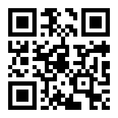
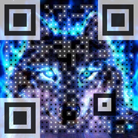
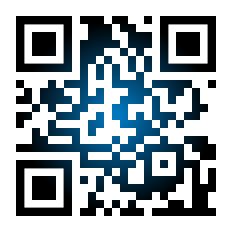
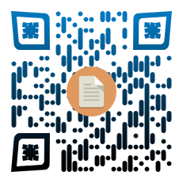
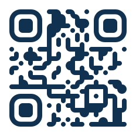
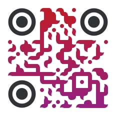
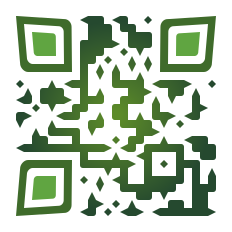
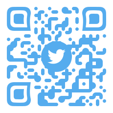

# QRlib

QRlib is an pure python qr code generator which can be used to create simple QR code , designer QR code or trackable QR codes

## References

* [Installation](#Installation)
* [Requirements](#Requirements)
* [CLI](https://github.com/#command-line-arguments)
* [Imorting](#Importing-QRlib)
* [Generating QR](#Generating-QR-codes)
    * [Classic QR](#classic-qr)
    * [Tansparent QR](#Tansparent-QR)
    * [Clear QR](##Cust-QR)
    * [Custom QR](#Custom-QR)
    * [Web QR](#Web-QR)
    * [fast_design QR](#fast_design-QR)
* [Data For Data](#Types-Of-Data-For-QR)
    * [Text Data](#Text-Data)
    * [URL Data](#URL-Data)
    * [Email Data](#Email-Data)
    * [Phone Data](#Phone-Data)
    * [SMS Data](#SMS-Data)
    * [vcard Data](#vcard-Data)
    * [Location Data](#Location-Data)
    * [Wifi Data](#Wifi-Data)
    * [Event Data](#Event-Data)
    * [Mecard Data](#Mecard-Data)
    * [Host data](#Host-data)
    * [Trace URL data](#Trace-URL-data)
* [ISSUES](#ISSUES)
* [License](#License)
* [Version Info](#Version-Info)


## What is a QR Code?


A Quick Response code is a two-dimensional pictographic code used for its fast readability and comparatively large storage capacity. The basic QR code consists of black modules arranged in a square pattern on a white background. The information encoded can be made up of any kind of data (e.g., binary, alphanumeric, or Kanji symbols).


## Installation


you can install QRlib with pip command
```bash
pip install QRlib
```
or with pip3
```bash
pip3 install QRlib
```

## Requirements


* python 3.4 or above
* Internet Connection
* [requests module](https://pypi.org/project/requests/)
* [tqdm module](https://pypi.org/project/tqdm/)
* [blockspring module](https://pypi.org/project/blockspring/)
* [urllib module](https://pypi.org/project/urllib3/)

## Command Line Arguments
* ##### to update QRlib to latest version
    * ```python -m QRlib --update```

    * ```python -m QRlib -u```
* ##### to get help on module QRlib
    * ```python -m QRlib --help```

    * ```python -m QRlib -h```

## Importing QRlib


import QRlib with command
```python
from QRlib.QRlib import *
```

## Generating QR codes

###### *Classic QR*


|  |
|:------:|
|    ```classic```    |


```python

from QRlib.QRlib import *

img_name = "ClassicQR" # name of Qr without extension of image ( default to png )
qr_data = "this is an classic qr" # content of qr
size = 200 # size in pixal ( optional )

qr.classic(qr_data, img_name, size=size)
```

___
###### *Tansparent QR*


|  |
|:------:|
|    ```transparent```    |


```python

from QRlib.QRlib import *

img_name = "TransparentQR" # name of Qr without extension of image ( default to png )
qr_data = "this is an Transparent qr" # content of qr
img_url = "https://raw.githubusercontent.com/Himanshu-Cyber-Code/QRlib/master/images/QR_sample_QRlib/transparent_test.png" # url for the image ( optional )
size = 200 # size in pixal ( optional )

qr.transparent(qr_data, img_name, img=img_url, size=size)
```

-------


###### *Clear QR*


|  |
|:------:|
|    ```clear```    |


```python

from QRlib.QRlib import *

img_name = "ClearQR" # name of Qr without extension of image ( default to png )
qr_data = "this is an Clear qr" # content of qr
size = 200 # size in pixal ( optional )

qr.clear(qr_data, qr_name, size=size)
```
-------
###### *Custom QR*

|  |  |  |  |  |  |  |  |  |  |   |  |  |  |  |  |   |
|:------:|:------:|:------:|:------:|:------:|:------:|:------:|:------:|:------:|:------:|:------:|:------:|:------:|:------:|:------:|:------:|:------:|
|    ```Custom_1```    |        |    ```Custom_2```    |        |    ```Custom_3```    |        |    ```Custom_4```    |        |    ```Custom_5```    |        |    ```Custom_6```    |        |    ```Custom_7```    |        |    ```Custom_8```    |        |    ```Custom_9```    |


And +1000 More Design`s

```python

# An Minimum Example

from QRlib.QRlib import *

img_name = "CustomQR" # name of Qr without extension of image ( default to png )
qr_data = "this is an Custom qr" # content of qr

qr.custom(qr_data, qr_name)
```

```python

# An Maximum Example

from QRlib.QRlib import *

img_name = "CustomQR" # name of Qr without extension of image ( default to png )
qr_data = "this is an Custom qr" # content of qr

qr.custom(
qr_data,
qr_name,
body=6,  # Pattern Of QR Body
frame=5,  # Eye Frame Pattern
bodyc7,  # QR Eye Ball Pattern
bodycolor=(17, 49, 81),  # Colour For QR Body
bgcolor=(255, 255, 255),  # QR Back Ground Colour
ballcolor=(17, 49, 81),  # QR Eye Ball Colour
framecolor=(17, 49, 81),  # QR Frame Colour
shadecolor=(17, 49, 81),  # Colour Of Other  Shade Which Will Be Mix With Body Colour
shadeonball=True,  # If Shade Has To Be Applied On Eye Balls of Qr
shadetype=0,  # Type Of shade From Linear Or Radial
logo='https://raw.githubusercontent.com/Himanshu-Cyber-Code/QRlib/master/images/QR_sample_QRlib/transparent_test.png',  # Logo On Qr ( URL )
size=200 # Size For Qr
)
```


|  Body Design  |  No. |    |  Frame Design   |  No.   |     |  Ball Design  |  No.  |
|:------:|:------:|:------:|:------:|:------:|:------:|:------:|:------:|
|         |    0     |    |         |    0     |    |         |    0     |
|         |    1     |    |         |    1     |    |         |    1     |
|         |    2     |    |         |    2     |    |         |    2     |
|         |    3     |    |         |    3     |    |         |    3     |
|         |    4     |    |         |    4     |    |         |    4     |
|         |    5     |    |         |    5     |    |         |    5     |
|         |    6     |    |         |    6     |    |         |    6     |
|         |    7     |    |         |    7     |    |         |    7     |
|         |    8     |    |         |    8     |    |         |    8     |
|         |    9     |    |         |    9     |    |         |    9     |
|        |    10    |    |        |    10    |    |        |    10    |
|        |    11    |    |        |    11    |    |        |    11    |
|        |    12    |    |        |    12    |    |        |    12    |
|        |    13    |    |        |    13    |    |        |    13    |
|        |    14    |    |        |    14    |    |        |    14    |
|        |    15    |    |                                                                      |          |    |        |    15    |
|        |    16    |    |                                                                      |          |    |        |    16    |
|        |    17    |    |                                                                      |          |    |        |    17    |
|        |    18    |    |                                                                      |          |    |                                                                   |          |
|        |    19    |    |                                                                      |          |    |                                                                   |          |
|        |    20    |    |                                                                      |          |    |                                                                   |          |
|        |    21    |    |                                                                      |          |    |                                                                   |          |


___
###### *Web QR*


|  |  |
|:------:|:------:|
|    ```Web QR```    |    [Link In QR](https://is.gd/mczMv4)    |


```python

# Web QR are online And Can Be Used In Track Data To Get Trackable QR ( Details On Track Data Bellow )
from QRlib.QRlib import *

img_name = "WebQR" # name of Qr without extension of image ( default to png )
qr_data = ["line 1", "line 2", "line 3", "line 4", "line 5"] # content of web qr should be list of string each string represents line break ( maximum line is 5 )
tittle = "i am tittle" # tittle of the web page ( optional )

qr.web(qr_data, img_name, tittle=tittle)
```

###### *fast_design QR*

custom QR very hard to design every time because of their large options so there is the solution. 

```python

# Generate a json containing the design for custom QR with commannd
# And Use It In Future As A Template

from QRlib.QRlib import *

name = "json_file.json"
generate.json_custom(
name, 
body=6, 
frame=5, 
ball=7, 
bodycolor=(17, 49, 81), 
bgcolor=(255, 255, 255), 
ballcolor=(17, 49, 81), 
framecolor=(17, 49, 81), 
shadecolor=(17, 49, 81), 
shadeonball=True, 
shadetype=0, 
logo="", 
size=200,
)
```

To Use It

```python

from QRlib.QRlib import *

json_file_path = r"C:/My/Path/To/json_file.json"

qr.fast_design(qr_data, img_name, json_file_path)
```

## Types Of Data For QR

Data In QR Are In Special Formats Which Is Readable By QR Scanners.
Some Can Be Generated By These Commands
to use them place them in the qr_data fields of qr

###### *Text Data*

```python

from QRlib.QRlib import *
data.text("Some Text")
```

###### *URL Data*

```python

from QRlib.QRlib import *
data.url("https://example.com")

# if the url is much big then you can short it with adding a command short=True
data.url("https://example.com", short=True) # this will return a url some thing like https://is.gd/abcdef ( no matter how big is url )
```

###### *Email Data*

```python

from QRlib.QRlib import *
email = "example@example.com"
subject = "i am the subject of email"
message = "i am the body of email"
data.email(email, subject = subject, message = message)
```

###### *Phone Data*

```python

from QRlib.QRlib import *
phone_number = "+919998887766"
data.phone(phone_number)
```

###### *SMS Data*

```python

from QRlib.QRlib import *
phone_number = "+919998887766"
message = "i am message for the sms"
data.sms(phone_number, message=message)
```

###### *vcard Data*

vcard are use in two versions to specify the version use command data.vcard2 or data.vcard3

```python

from QRlib.QRlib import *

first_name = "First_Name"

data.vcard2(
firs_tname, 
lastname="Last_Name",                #( optional )
position="my position",              #( optional )
work="Job",                          #( optional )
org="my Organization",               #( optional )
website="https://example.com",       #( optional )
email="example@example.com",         #( optional )
phone="+918887776655",               #( optional )
homephone="+913332225577",           #( optional )
workphone="+912223336655",           #( optional )
homefax="56282",                     #( optional )
workfax="53794",                     #( optional )
city="MyCity",                       #( optional )
state="MyState",                     #( optional )
country="MyCountry",                 #( optional )
zipcode="836619",                    #( optional )
street="MyStreet",                   #( optional )
)
```

###### *Location Data*

```python

from QRlib.QRlib import *
Latitude = 4637368
Longitude = 4827636
data.location(Latitude, Longitude)
```

###### *Wifi Data*

```python

from QRlib.QRlib import *
wifi("ssid", "password", encryption=0) # 0='nopass' , 1='WPA' , 2='WEP'
```

###### *Event Data*

```python

from QRlib.QRlib import *

tittle = "Event Tittle"
location = "My Location"

data.event(
tittle, 
location=location, 
start=[2020,6,16,11,54], # default is current time (start time of event) ([year,month,date,hour,minute])
end=[2020,6,16,11,54], # default is current time (end time of event) ([year,month,date,hour,minute])
)
```

###### *Mecard Data*

```python

from QRlib.QRlib import *

First_Name = "FirstName"

mecard(
First_Name, 
lastname="lastname", 
nickname="Nick Name",                   #( optional )
email="Email@Email.com",                #( optional )
phone1="+5366647168",                   #( optional )
phone2="+474725367158",                 #( optional )
phone3="+467835357471",                 #( optional )
dob=[2020,6,16], #(year,month,date)     #( optional )
note="a short note",                    #( optional )
city="city",                            #( optional )
state="state",                          #( optional )
country="country",                      #( optional )
zipcode="536829",                       #( optional )
street="MyStreet",                      #( optional )
)
```

###### *Host data*

this is a special type of data which can be use to put upto _100GB_ of data in a QR
for this you just need a email account

STEPS :-

* make a gmail account
* you will get 15GB of free space on google drive
* on google drive make a folder named QRlib
* now upload the file(images,APK,pdf,etc) which you want to put in QR
* then write the following command
* they will get hosted on internet with a direct URL which will be put in QR

```python

from QRlib.QRlib import *
email = "example@example.com"
file = "QRlib.png"
data.host(email ,file)
```

###### *Trace URL data*

```python

from QRlib.QRlib import *
url = "https://example.com"
data.trace(url, action=1)
# action = 1 will generate a url with a suffix https://is.gd/ which can be traced in future
```
to trace the url generated above use action = 0

```python

from QRlib.QRlib import *
url = # the url generated above
data.trace(url ,action=0)
# this will return a url which will contain the statistics of the given url
```

## ISSUES

If any issues are seen in this module then feel free to tell us at [Our GitHub Page](https://github.com/Himanshu-Cyber-Code/QRlib/issues)

## License

##### MIT

```
MIT License

Copyright © 2020 Himanshu Jha

Permission is hereby granted, free of charge, to any person obtaining a copy
of this software and associated documentation files (the "software"),
to deal in the Software without restriction, including without limitation the 
rights to use, copy, modify, merge, publish, distribute, sublicense, and/or sell
copies of the Software, and to permit persons to whom the Software is
furnished to do so, subject to the following conditions:

The above copyright notice and this permission notice shall be included in all
copies or substantial portions of the Software.

THE SOFTWARE IS PROVIDED "AS IS", WITHOUT WARRANTY OF ANY KIND, EXPRESS OR
IMPLIED, INCLUDING BUT NOT LIMITED TO THE WARRANTIES OF MERCHANTABILITY,
FITNESS FOR A PARTICULAR PURPOSE AND NONINFRINGEMENT. IN NO EVENT SHALL THE
AUTHORS OR COPYRIGHT HOLDERS BE LIABLE FOR ANY CLAIM, DAMAGES OR OTHER
LIABILITY, WHETHER IN AN ACTION OF CONTRACT, TORT OR OTHERWISE, ARISING FROM,
OUT OF OR IN CONNECTION WITH THE SOFTWARE OR THE USE OR OTHER DEALINGS IN THE
SOFTWARE.

THIS MIT LICENSE DOES NOT INCLUDE T&C FOR THE API(s), OTHER PYTHON MODULE(s)
AND SOFTWARE(s) USED IN THIS SOFTWARE
```
## **Version Info**

#### _Version 1.0.0_
* [x] Simple QR
* [x] custom QR
* [x] trackable QR 
* [x] Web QR
* [ ] video QR
* [ ] Web Support
* [x] Github support
* [ ] Local images support
* [x] live tracking


[__GO TO TOP__](#QRlib)
